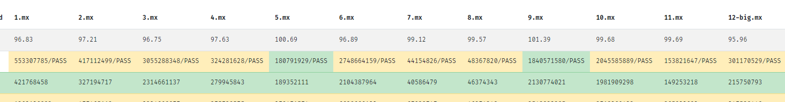

# Masterball

<div align="center">
	
</div>


 Masterball, an elaborate Mx* Compiler. Passed all testcases in Online Judge.

 Actually, it is a toy compiler for course project. Therefore, many implementations are quite simple and there may be some bugs.

 It will compile Mx* language (a language for this project) code to RISC-V 32 Integer assembly.

 It is implemented in Java, JDK 11. And the lexer and parser in the FrontEnd are supported by antlr v4 framework.


          


## Usage

run this compiler by

```
$ java -jar Masterball (...args)
```

see the help doc by run compiler with `-h` argument

```
$ java -jar Masterball -h
```


## Feature

- High Performance. Close to gcc O2 (with some testcases surpass). Average store: 98.45. 

  

- Standard LLVM implemented. (validated by llc)

- [Elegant Design](doc/Feature.md) in many parts. 

- Some syntactic sugar implemented. (e.g. `for (int i=1; i<=n; i++)`)


## Pitfall

- The load part of GVN. The correctness is not sure.
- backend/optim/TRO. May cause too long assembly.
- Induction Variable can do better. (even can calculate 1+2+...+n).
- use simple Liveness Analysis in Alias Analysis may work better. (but actually not too much)


## Mx*

Mx* or MxStar is a language designed for this course.

The grammar is defined in [AssignmentRequirement](doc/README.md)

a simple syntax highlight for this language: see `hightlight/`


## Design

Masterball Project contains three main parts.

- masterball compiler  `package masterball.compiler`
  - core of the project, consists of FrontEnd, MiddleEnd and BackEnd.
  - receive the input stream from console and emit the assembly.
- masterball console  `package masterball.console`
  - provides a simple CLI for the user / online judge.
  - parse the arguments and control the compiler. 
  - simple help document and version information.
- masterball log  `package masterball.debug`
  - some debug kits for the developer of this compiler (=me)


Click the following links to read the project design in detail.

- [General Design](doc/GeneralDesign.md)
- [Grammar Design](src/masterball/grammar/MxStar.g4)
- [FrontEnd Design](doc/FrontEndDesign.md)
- [MiddleEnd Design](doc/IRDesign.md)
- [BackEnd Design](doc/BackEndDesign.md)
- [Register Allocation Algorithm](doc/RegisterAllocation.md)


The optimizations Masterball uses:

- [Optimization](doc/Optimization.md)


## TO DO


### FrontEnd (Semantic Check)

- [x] .g4
- [x] AST Design
- [x] Scope & Registry
- [x] AST Builder
- [x] Semantic Checker
- [x] Data Oriented Debug


### MiddleEnd (IR Builder)

- [x] IR Design (LLVM IR)
- [x] Type, Constant, Inst, Hierarchy
- [x] Skeleton, can generate my first IR
- [x] Type System
- [x] IR Builder (before MEM2REG)
- [x] IR debug (use clang-llvm tools)


### BackEnd (ASM)

- [x] SSADestructor (without MEM2REG phi nodes are all simple)
- [x] ASM Design (RISCV-32I)
- [x] Inst, Operand, Hierarchy
- [x] ASMBuilder
- [x] RegisterAlloca (GraphColoring) 
- [x] Debug (ok... it will take me a long time)


### MiddleEnd (Optimizer)

- [x] Mem2Reg
- [x] SSA Destructor
- [x] CFG Simplifier
- [x] SCCP
- [x] Glo2Loc
- [x] ADCE
- [x] Function Inliner
- [x] Induction Variable Strength Reduction
- [x] GVN or CSE
- [x] LICM
- [x] TCO & TRO
- [x] Local MO
- [x] Inst Adapter
- [ ] Unrolling


