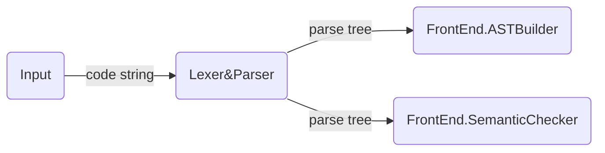
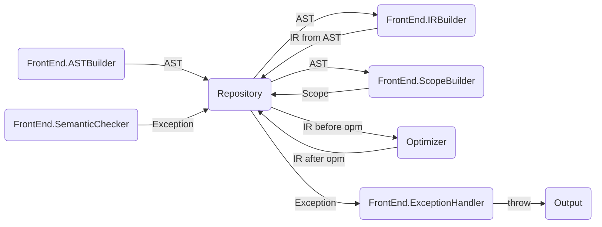

# Architecture

Now in: `semantic check`


## Design Rules

- Simple and Clear
- High Performance
- Compromise


## Structure

### File Structure

```
src/masterball/
- compiler (core)
  - antlr
  - org
  - frontend
  - backend
  - repository
  - optimizer
- debugger
- engine
- grammar
  - g4
```


### Work Structure







## AST Design

```
Instead of:
	exp -> atom:(exp) -> exp
	suite -> stmt:(suite) -> suite
We use:
	exp:(exp) -> atom
	suite:{suite} -> suite
```


### Type Pack


### Node Pack

- BaseNode

- RootNode

  ```
  List <ClassDefNode>
  List <FuncDefNode>
  List <VarDefStmtNode>
  ```

- ClassDefNode

  ```
  classIdentifier
  List <VarDefStmtNode> memberVar
  List <FuncDefNode> mermberFunc
  ```

- FuncDefNode

  ```
  funcIdentifier
  retType
  List funcArgs
  SuiteNode suiteNode
  ```

- SuiteNode/

  - SuiteBaseNode

  - SuiteNode

- StmtNode/

  - StmtBaseNode

  - IfStmtNode
  - ForStmtNode
  - WhileStmtNode
  - ReturnStmtNode
  - ControlStmtNode
  - VarDefStmtNode
  - PureDefStmtNode

- ExpNode/

  - ExpBaseNode
  - FuncCallExpNode
  - IndexExpNode
  - MemberExpNode
  - NewExpNode
- PrefixExpNode
  - PostfixExpNode
  - BinaryExpNode
  - UnaryExpNode
  - AssignNode

