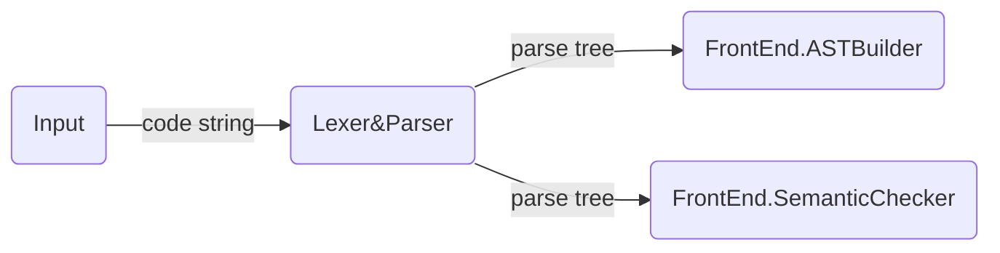
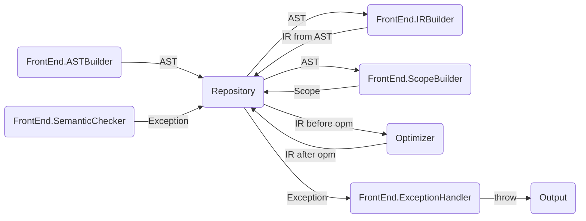

# Architecture

Now in: `semantic check`


## Design Rules

- Simple and Clear
- High Performance
- Compromise


## Structure

### File Structure

```
src/masterball/
- compiler (core)
  - antlr
  - org
  - frontend
  - backend
  - repository
  - optimizer
- debugger
- engine
- grammar
  - g4
```


### Work Structure







## AST Design

- RootNode

