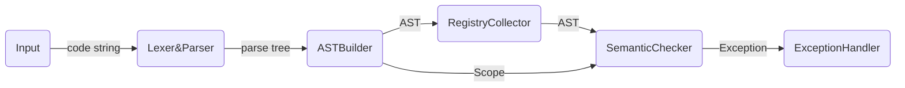

# FrontEnd Design


## Work Pipe

### Semantic


## AST Design

```
Instead of:
	exp -> atom:(exp) -> exp
We use:
	exp:(exp) -> atom
```


### Node Pack

A Node usually contains

- `CodePos`  used in throw Exception. All Nodes.

- `Scope`  used to manage namespace. Only five types of nodes have:

  - `RootNode`		
  - `ClassDefNode` 
  - `FuncDefNode` (Parameters)
  - `ForStmtNode` (init)
  - `SuiteNode`

  And the visitor will pull the scope into the scope stack when they meeting a node with Scope.

- `Registry`  Only in "Def" Type Node.

  A Registry records the information need in define a variable/func/class, recorded in Scope to do semantic check.

- `<some son Nodes>`

  vary from different Nodes.

- `<some must information>`

  enum type or integer etc.


#### Node List

- `BaseNode`

- `RootNode`

- `ClassDefNode`

- `FuncDefNode`

- `SuiteNode`

- `VarDefNode`

- `StmtNode/`

  - `StmtBaseNode`

  - `IfStmtNode`
  - `ForStmtNode`
  - `WhileStmtNode`
  - `ReturnStmtNode`
  - `ControlStmtNode`
  - `VarDefStmtNode`
  - `PureStmtNode`

- `ExpNode/`

  - `ExpBaseNode`
  - `FuncCallExpNode`
  - `IndexExpNode`
  - `MemberExpNode`
  - `NewExpNode`
  
  - `PrefixExpNode`
  
  - `PostfixExpNode`
  - `BinaryExpNode`
  - `UnaryExpNode`
  - `AssignNode`


## Registry Design

Registry is like a Object's Household Register. It records information of a declaration.

- `Class Registry`
- `Func Registry`
- `Var Registry`


## Error Design

Error, or Exception (In fact there are some difference, but I think Error is more suitable to describe this wrong.)

- `Syntax Error`
  - `Parse Failed`
  - `MainFunc Error`
- `Semantic Error`
  - `Name Undefined`
  - `Name Redefined`


## Scope Design

Scope, for managing a "namespace".

Provide the necessary interfaces to register a variable / function / class.

- `Base Scope`

- `Global Scope`

  Able to register: class, var, func

- `Locality Scope`

  Able to regiser: var

  Use in: func def, if/while/for stmt, scope in scope

- `Class Scope`

  Use in: class def

  Able to regiser: func var