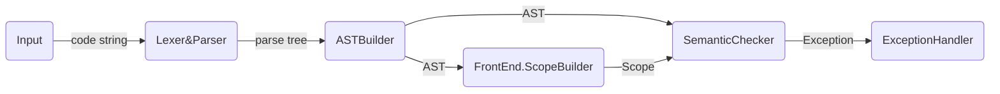

# Architecture


## Work Pipe

### Semantic


## AST Design

```
Instead of:
	exp -> atom:(exp) -> exp
We use:
	exp:(exp) -> atom
```


### Node Pack

- BaseNode

  ```
  Position
  ```

- RootNode

  ```
  List <ClassDefNode>
  List <FuncDefNode>
  List <VarDefStmtNode>
  ```

- ClassDefNode

  ```
  classIdentifier
  List <VarDefStmtNode> memberVar
  List <FuncDefNode> mermberFunc
  ```

- FuncDefNode

  ```
  funcIdentifier
  List funcArgs
  SuiteNode suiteNode
  ```
  
- StmtNode/

  - StmtBaseNode

  - IfStmtNode
  - ForStmtNode
  - WhileStmtNode
  - ReturnStmtNode
  - ControlStmtNode
  - VarDefStmtNode
  - PureStmtNode

- ExpNode/

  - ExpBaseNode
  - FuncCallExpNode
  - IndexExpNode
  - MemberExpNode
  - NewExpNode
- PrefixExpNode
  - PostfixExpNode
  - BinaryExpNode
  - UnaryExpNode
  - AssignNode


## Exception Design

### ExceptionType

Syntax Exception

Semantic Exception


## ScopeDesign

### ClassRegister

- Register All Class First -- To avoid:

  ```
  class A {B b;};
  class B {A a;};
  ```

  

### Scope

Attatched to Node (?)

- Base Scope

- Global Scope

  Able to register: class, var, func

- Locality Scope

  Able to regiser: var

  Use in: func def, if/while/for stmt, scope in scope

- Class Scope

  Use in: class def

  Able to regiser: func var