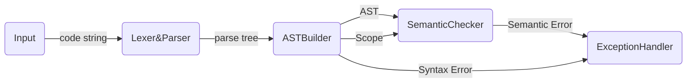

# FrontEnd Design

## Work Pipe

the semantic check contains two steps:

- First, the `ASTBuilder`
  - Build the AST
  - Register all classes and functions
  - throw some `Syntax Error` ( also some basic `Semantic Error` )
  - Assign types to New
- Second, the `SemanticChecker`
  - Register the others (Scope Stack)
  - Assign types to All Exp Nodes
  - Semantic check, throw `Semantic Error`

This is because Mx* should implement the forwarding reference of classes and global functions.

## AST Design

### Node Pack

A Node usually contains

- `CodePos`  used in throw Exception. All Nodes.

- `Scope`  used to manage namespace. The following nodes have scopes attached to them.

  - `RootNode`		
  - `ForStmtNode` 
  - `WhileStmtNode`
  - `IfStmtNode`  (This one have two scopes: ifTrue, else)
  - `SuiteNode`

  And the visitor will pull the scope into the scope stack when they meeting a node with Scope.

  The following two Node types contains Registry with Scope:

  - `ClassDefNode` 
  - `FuncDefNode` (Parameters)

- `Registry`  Only in "Def" Type Node.

  A Registry records the information need in define a variable/func/class, recorded in Scope to do semantic check.

- `<some son Nodes>`

  vary from different Nodes.

- `<some must information>`

  enum type or integer etc.

#### Node List

- `BaseNode`

- `RootNode`

- `ClassDefNode`

- `FuncDefNode`

- `SuiteNode`

- `VarDefNode`

- `StmtNode/`

  - `StmtBaseNode`

  - `IfStmtNode`
  - `ForStmtNode`
  - `WhileStmtNode`
  - `ReturnStmtNode`
  - `ControlStmtNode`
  - `VarDefStmtNode`
  - `PureStmtNode`

- `ExpNode/`

- `ExpBaseNode`
  
  - `AtomExpNode`
  
  - `FuncCallExpNode`
  - `IndexExpNode`
  - `MemberExpNode`
  - `NewExpNode`
  
  - `PrefixExpNode`
  
  - `PostfixExpNode`
  - `BinaryExpNode`
  - `UnaryExpNode`
  - `AssignNode`

## Type & Registry Design

Type is mainly for "match":

For class, there is no need to match; For func, match a valid func-call; For variable, match their builtin-type and dimension.

- `BaseType`
- `VarType`
- `FuncType`

Registry is like a Object's Household Register. It records information of a declaration. (Type + name + scope)

- `BaseRegistry`
- `VarRegistry`
- `FuncRegistry`
- `ClassRegistry`

## Error Design

Error, or Exception (In fact there are some difference, but I think Error is more suitable to describe this wrong.)

- `Syntax Error`
  - `ParseFailedError`
  - `MainFuncError`
  - `ArrayDeclarationError`
  - `ClassDeclarationError`
- `Semantic Error`
  - `FuncCallError`
  - `FuncReturnError`
  - `NameError`
  - `ScopeError`
  - `TypeError`
  - `UndefinedBehaviourError`

## Scope Design

Scope, for managing a "namespace".

Provide the necessary interfaces to register a variable / function / class.

And give response to a variable / function / class call 

- `BaseScope`

- `GlobalScope`

  Able to register: class, var, func

- `NormalScope`

  Able to regiser: var

  Use in: suite

- `ClassScope`

  Use in: class def

  Able to regiser: func var
  
- `FuncScope`

  Use in: func def

- `LoopScope`

  Use in: for-loop, while-loop
  
- `IfScope`

  Use in: if, else